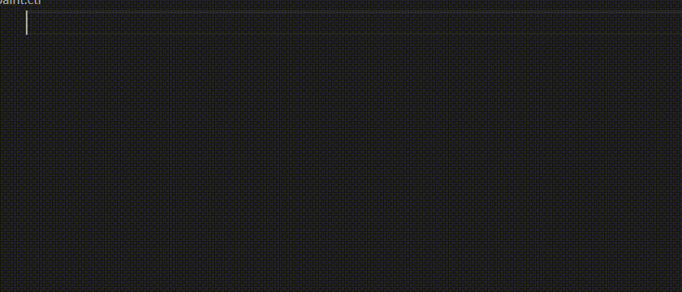
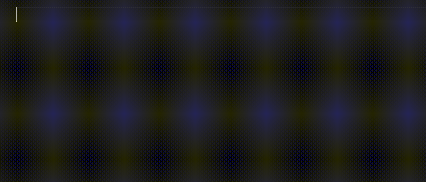

# OMSI Syntax highlighting and Snippets for Visual Studio Code

Provides basic syntax highlighting and snippets to:
+ OMSI configuration files (`.cfg`,`.bus`,`.ovh`, `.cti`,`.sco`,`.hum`)
+ OMSI scripts (`.osc`)

## Features

The syntax highlighting for configuration files is very basic and only includes the tags (e.g. `[mesh]`), whilst for the scripting language it is much richer.

The snippets for the configuration files are provided for almost all the known tags and consist in the tag with a list of parameters that can be completed. The goal is to speed up common tasks.

The snippets for the scripts are provided for macro and trigger definitions
and for all the operations like `L.L. L.$. ...`, for which the snippet can
be recalled with its non-dotted counterpart (i.e. `ll ls ...`).

## Extension Settings

No additional settings are provided.

## Known Issues

- VSCode suggests folding for single-line comments in scripts

## Release notes

### 1.2.0
Add new snippets and fix existing ones (thanks to [zheka20012](https://github.com/zheka20012))

### 1.1.1
Code cleanup and fixes (thanks to [Road-hog123](https://github.com/Road-hog123))

### 1.1.0
Add code folding support and fix highlighting (thanks to [sjain](https://github.com/sjain882))

### 1.0.0
Fix typos and bugs with OMSI script language (thanks to [Road-hog123](https://github.com/Road-hog123))

### 0.2.0
Fix parameters for money point tags and remove auto-closing single quotes

### 0.1.0
Initial release
